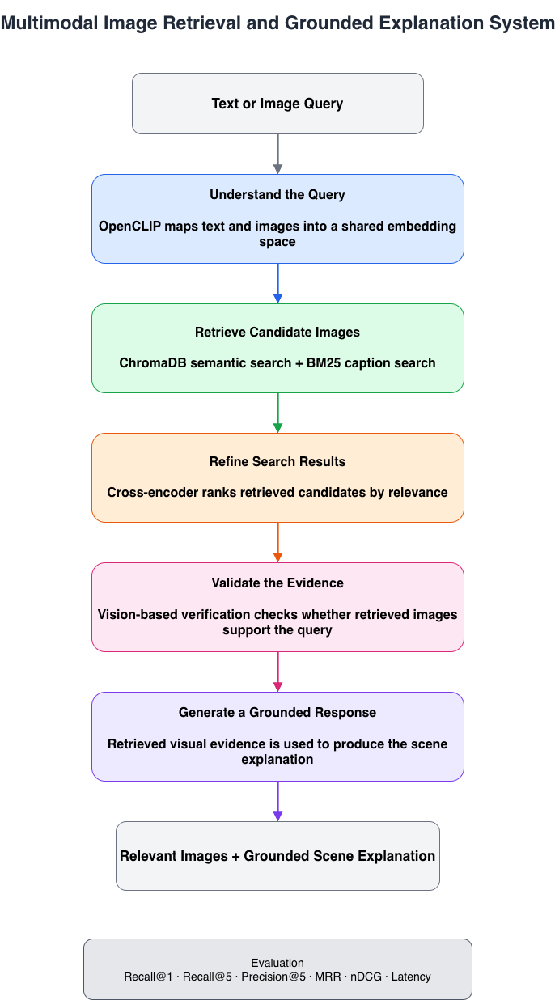

# Multimodal Image Retrieval System with Hybrid Search and Grounded Explanations

A multimodal retrieval system that supports **text-to-image**, **image-to-image**, and **image-to-caption** search using vision-language embeddings. The system combines semantic retrieval, lexical retrieval, cross-encoder reranking, LLM-based image verification, and grounded generation to improve retrieval quality and produce evidence-backed scene explanations.

The retrieval pipeline is evaluated on the **COCO 2017** validation set using standard information retrieval metrics including **Recall@K, Precision@K, MRR, nDCG, and latency**.

---

## Technology Stack

**Deep Learning**
- PyTorch
- OpenCLIP (ViT-L-14)
- SentenceTransformers

**Retrieval**
- ChromaDB
- BM25
- NumPy

**LLM**
- GPT-4o-mini Vision
- LangChain

**Application**
- Chainlit

---

# Project Pipeline

The system improves retrieval quality through a sequence of retrieval and ranking stages.

1. Encode text and images into a shared embedding space using OpenCLIP.
2. Retrieve candidate images using semantic vector search and lexical BM25 search.
3. Re-rank retrieved candidates with a cross-encoder.
4. Verify retrieved images using GPT-4o-mini Vision.
5. Generate grounded scene explanations from retrieved visual evidence.

---

# Architecture

---

# Key Components

## Multimodal Embedding

- Encodes images and captions into a shared embedding space using OpenCLIP.
- Stores image embeddings in ChromaDB for persistent vector search.

---

## Hybrid Retrieval

Combines complementary retrieval strategies:

- Semantic retrieval using OpenCLIP embeddings
- Lexical retrieval using BM25
- Weighted score fusion
- Retrieval fallback strategy for robust inference

---

## Cross-Encoder Re-ranking

Refines the initial candidate set using a SentenceTransformers cross-encoder to improve ranking quality before downstream reasoning.

---

## Image Verification

Uses GPT-4o-mini Vision to verify whether retrieved images support the user query.

Each retrieved image receives:

- relevance score
- verification verdict
- explanation

Low-confidence matches are filtered before response generation.

---

## Grounded Scene Explanation

Retrieved captions are formatted as evidence using LangChain prompt templates before generating scene descriptions.

This constrains the LLM to retrieved context instead of relying solely on parametric knowledge.

---

## Interactive Demo

The project includes a Chainlit interface supporting

- text-to-image retrieval
- image-to-image retrieval
- grounded scene explanation
- retrieval score visualization
- image verification

[▶ Watch Demo](images/test.mp4)

---

# Experimental Results

| Method | Recall@1 | Recall@5 | MRR | nDCG@5 |
|--------|---------:|---------:|----:|-------:|
| Dense Retrieval | 0.37 | 0.65 | 0.47 | 0.52 |
| ChromaDB Retrieval | 0.36 | 0.64 | 0.47 | 0.51 |
| Hybrid Retrieval | 0.80 | 0.92 | 0.85 | 0.86 |
| Hybrid + Cross-Encoder | **0.96** | **0.98** | **0.97** | **0.97** |

The staged retrieval pipeline improves **Recall@1 by approximately 2.6×** compared with dense retrieval while maintaining high retrieval precision.

---

